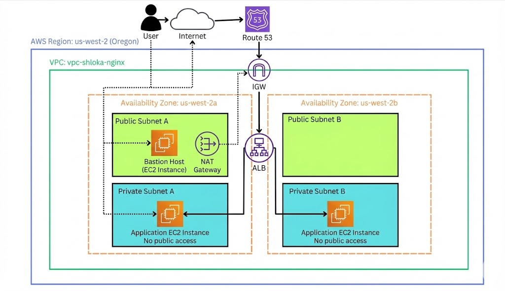

# Hardened EC2 Web Server Behind ALB with HTTPS (AWS)

## Project Overview
Designed and deployed a **secure, production-style AWS web architecture** using private EC2 instances behind an Application Load Balancer (ALB) with HTTPS enabled via AWS Certificate Manager (ACM) and DNS routing through Route 53.

The setup follows **AWS best practices** for networking, security, and high availability using isolated subnets, NAT Gateway, and a Bastion Host.

---

## Architecture Overview

**Region:** us-west-2 (Oregon)

### Key Design Principles
- No public access to application servers
- Layered security using Security Groups
- High availability across multiple Availability Zones
- Encrypted traffic using HTTPS

### Core Components
- Custom VPC (10.0.0.0/16)
- 4 Subnets across 2 Availability Zones
  - 2 Public Subnets (ALB, Bastion Host, NAT Gateway)
  - 2 Private Subnets (Application EC2 instances)
- Internet Gateway (IGW)
- NAT Gateway
- Application Load Balancer
- Route 53 DNS
- ACM (SSL/TLS Certificate)

**Architecture Diagram:**  

---

## Security Architecture Highlights
- EC2 instances deployed **only in private subnets**
- SSH access restricted via **Bastion Host**
- Bastion Host allows SSH **only from my IP**
- Private EC2 Security Group:
  - Allows port **8443 only from ALB**
  - Allows SSH **only from Bastion Security Group**
- HTTPS enforced using **ACM-managed certificate**

---

## Deployment Flow
1. Created a custom VPC with public and private subnets across two AZs
2. Attached Internet Gateway for public resources
3. Configured NAT Gateway to enable outbound internet access for private EC2 instances
4. Launched EC2 instances in private subnets with Nginx installed via user-data
5. Deployed Application Load Balancer in public subnets
6. Configured Target Group listening on custom port **8443**
7. Registered domain and routed traffic using Route 53 Alias record
8. Enabled HTTPS by attaching ACM certificate to ALB listener (port 443)

[find  documentation with screenshots in the repo] 

---

## Testing & Validation
- SSH access verified through Bastion Host
- Private EC2 connectivity tested internally
- Target Group health checks passed
- Load Balancer DNS tested successfully
- HTTPS verified at: **https://shlokamdar.in** [test domain]

---

## Challenges & Troubleshooting

| Issue | Root Cause | Resolution |
|------|-----------|-----------|
| Target Group unhealthy | User-data failed due to no internet | Added NAT Gateway and redeployed |
| Private EC2 had no outbound access | Missing NAT Gateway | Configured NAT in public subnet |
| Domain not resolving | Nameservers not updated | Updated to Route 53 NS |
| ACM stuck in validation | DNS propagation delay | Waited for auto-validation |

---

## 🎯 What This Project Demonstrates
- Secure AWS VPC design
- Real-world networking (IGW, NAT, routing)
- Load balancing and traffic management
- DNS and HTTPS implementation
- Cloud troubleshooting and debugging
- Production-style AWS architecture

---

## Future Improvements
- Auto Scaling Group (ASG)
- AWS WAF integration
- Terraform-based IaC deployment
- Centralized logging using CloudWatch
